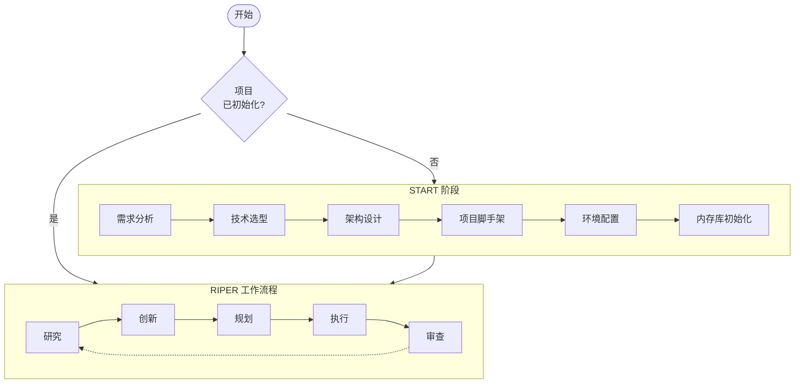

# CursorRIPER 框架

一个在 [Cursor IDE](https://www.cursor.com/) 中进行AI辅助软件开发的综合框架，结合了结构化工作流程和持久化内存。如果您担心令牌数量，我强烈建议您查看并使用更精简和高级的版本 [CursorRIPER.sigma](https://github.com/johnpeterman72/CursorRIPER.sigma)

## 概述

CursorRIPER通过五个不同的操作模式提供系统化的软件开发方法：

1. **Research（研究）**: 信息收集和理解现有代码
2. **Innovate（创新）**: 头脑风暴潜在方法和解决方案
3. **Plan（规划）**: 创建详细的技术规格
4. **Execute（执行）**: 精确实施已批准的计划
5. **Review（审查）**: 根据计划验证实施

该框架防止意外修改，同时在编码会话中保持完美的连续性。



## 功能特性

- **结构化工作流程**: 开发阶段的清晰分离
- **内存库**: 跨会话的持久化文档
- **项目智能**: 从模式和偏好中学习
- **状态管理**: 项目阶段和模式的显式跟踪
- **安全初始化**: 带有重新初始化保护的引导式设置

## 快速开始

1. 复制框架文件到您的项目并将扩展名更改为.mdc：
   ```bash
   cp -r /path/to/CursorRIPER/src/.cursor/* .cursor/
   rename 's/\.md$/.mdc/' *.md
   ```

2. 使用以下命令初始化您的项目：
   ```
   /start
   ```

3. 按照START阶段设置您的项目结构和内存库

4. 使用RIPER工作流程进行持续开发

## 文档

- [安装指南](docs/setup-guide-cn.md)
- [START阶段指南](docs/start-phase-guide-cn.md)
- [RIPER工作流程指南](docs/riper-workflow-guide-cn.md)
- [内存库指南](docs/memory-bank-guide-cn.md)
- [自定义模式指南](docs/custom-modes-guide-cn.md)
- [故障排除指南](docs/troubleshooting-guide-cn.md)

## 许可证

本项目采用MIT许可证 - 详情请参阅LICENSE文件。

---
原始RIPER框架由：[robotlovehuman](https://github.com/robotlovehuman) 开发

*CursorRIPER框架防止编码灾难，同时在会话间保持完美连续性。* 