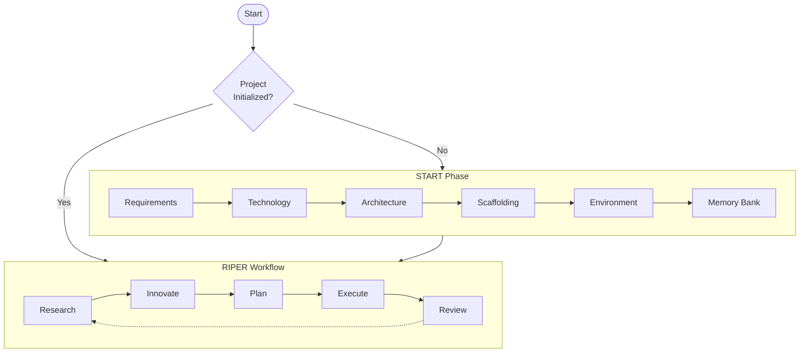

# CursorRIPER Framework 

A comprehensive framework for AI-assisted software development in [Cursor IDE](https://www.cursor.com/) that combines structured workflow with persistent memory.  If you are worried about token count, then check out the streamline version [CursorRIPER.sigma](https://github.com/johnpeterman72/CursorRIPER.sigma)

## Overview

CursorRIPER provides a systematic approach to software development through five distinct operational modes:

1. **Research**: Information gathering and understanding existing code
2. **Innovate**: Brainstorming potential approaches and solutions
3. **Plan**: Creating detailed technical specifications
4. **Execute**: Implementing approved plans with precision
5. **Review**: Validating implementation against plans

This framework prevents unintended modifications while maintaining perfect continuity across coding sessions.



## Features

- **Structured Workflow**: Clear separation of development phases
- **Memory Bank**: Persistent documentation across sessions
- **Project Intelligence**: Learning from patterns and preferences
- **State Management**: Explicit tracking of project phase and mode
- **Safe Initialization**: Guided setup with protection against re-initialization

## Getting Started

1. Copy the framework files to your project and change the extension to .mdc:
   ```bash
   cp -r /path/to/CursorRIPER/src/.cursor/* .cursor/
   rename 's/\.md$/.mdc/' *.md
   ```

2. Initialize your project with:
   ```
   /start
   ```

3. Follow the START phase to set up your project structure and memory bank

4. Use the RIPER workflow for ongoing development

## Documentation

- [Setup Guide](docs/setup-guide.md)
- [START Phase Guide](docs/start-phase-guide.md)
- [RIPER Workflow Guide](docs/riper-workflow-guide.md)
- [Memory Bank Guide](docs/memory-bank-guide.md)
- [Custom Modes Guide](docs/custom-modes-guide.md)
- [Troubleshooting Guide](docs/troubleshooting-guide.md)

## License

This project is licensed under the MIT License - see the LICENSE file for details.

---
The orginial RIPER framework is by: [robotlovehuman](https://github.com/robotlovehuman)

*The CursorRIPER Framework prevents coding disasters while maintaining perfect continuity across sessions.*
