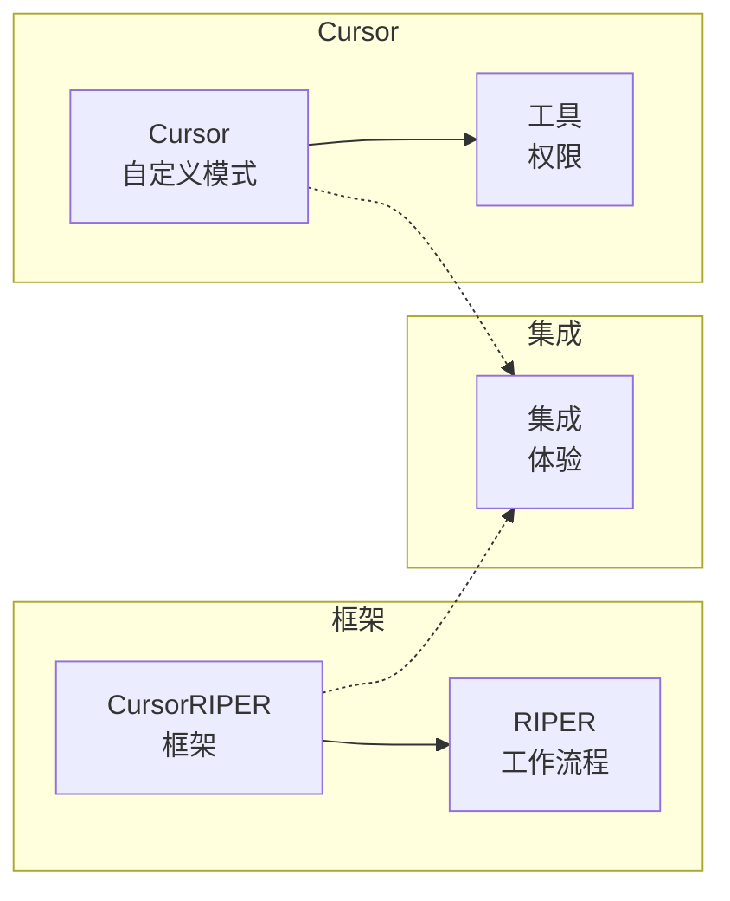

# CursorRIPER 框架 - 自定义模式指南

CursorRIPER框架可以选择性地与Cursor的自定义模式功能一起使用，以获得增强的用户体验。本指南解释了如何设置与RIPER工作流程一致的自定义模式。

## 自定义模式概述

Cursor的自定义模式功能允许您创建具有特定工具和指令的个性化AI助手模式。通过配置自定义模式以匹配RIPER工作流程，您可以使用视觉指示器和工具限制来增强框架。



## 为什么使用自定义模式

虽然CursorRIPER框架在没有自定义模式的情况下运行得很好，但与Cursor的自定义模式集成提供了额外的好处：

1. **视觉指示器**: 每个模式的图标和视觉提示
2. **工具权限**: 每个模式的适当工具限制
3. **快速访问**: 通过Cursor的模式下拉菜单轻松切换
4. **视觉反馈**: 当前模式的清晰指示
5. **原生集成**: 在Cursor中的无缝体验

## 设置自定义模式

为RIPER工作流程设置自定义模式：

1. **启用自定义模式**: 
   - 打开Cursor设置
   - 转到功能 → 聊天 → 自定义模式
   - 切换功能开关

2. **创建每个RIPER模式**: 对于每个模式，点击"添加自定义模式"并如下配置：

### 研究模式

- **名称**: Research
- **图标**: 🔍
- **快捷键**: Ctrl+Alt+R（或您的偏好）
- **工具**: 
  - ✅ 搜索代码库
  - ✅ 读取文件
  - ✅ 搜索文件
  - ✅ 网络搜索
  - ❌ 所有其他工具
- **自定义指令**: 
```
只收集信息和理解现有代码。不要做建议、实现或计划。每个响应以[MODE: RESEARCH]开始。只寻求理解存在的内容，而不是可能的内容。需要时提出澄清问题。
```

### 创新模式

- **名称**: Innovate
- **图标**: 💡
- **快捷键**: Ctrl+Alt+I
- **工具**: 
  - ✅ 搜索代码库
  - ✅ 读取文件
  - ✅ 搜索文件
  - ✅ 网络搜索
  - ❌ 所有其他工具
- **自定义指令**: 
```
头脑风暴潜在方法而不进行具体规划或实施。将所有想法作为可能性而不是决策呈现。每个响应以[MODE: INNOVATE]开始。讨论不同方法的优点和缺点。寻求对想法的反馈。
```

### 规划模式

- **名称**: Plan
- **图标**: 📝
- **快捷键**: Ctrl+Alt+P
- **工具**: 
  - ✅ 搜索代码库
  - ✅ 读取文件
  - ✅ 搜索文件
  - ✅ 网络搜索
  - ✅ 终端（只读）
  - ❌ 所有其他工具
- **自定义指令**: 
```
创建详细的技术规格而不进行任何实施。每个响应以[MODE: PLAN]开始。首先提出澄清问题，然后起草全面计划。将计划转换为具体行动的编号清单。不要编写或建议代码。
```

### 执行模式

- **名称**: Execute
- **图标**: ⚙️
- **快捷键**: Ctrl+Alt+E
- **工具**: 
  - ✅ 搜索代码库
  - ✅ 读取文件
  - ✅ 搜索文件
  - ✅ 编辑文件
  - ✅ 创建文件
  - ✅ 终端
  - ✅ 应用编辑
- **自定义指令**: 
```
完全按照计划模式中的计划实施，不偏离。每个响应以[MODE: EXECUTE]开始。如果任何问题需要偏离，立即返回计划模式。在实施时将项目标记为完成。跟踪对计划的进度。
```

### 审查模式

- **名称**: Review
- **图标**: 🔍
- **快捷键**: Ctrl+Alt+V
- **工具**: 
  - ✅ 搜索代码库
  - ✅ 读取文件
  - ✅ 搜索文件
  - ❌ 所有其他工具
- **自定义指令**: 
```
根据批准的计划验证实施，明确标记任何偏离。每个响应以[MODE: REVIEW]开始。将偏离通知格式化为":warning: 检测到偏离: [描述]"。以关于实施是否完全匹配计划的明确判断结束。
```

## 将自定义模式与CursorRIPER一起使用

设置自定义模式后，您可以将它们与CursorRIPER框架一起使用：

1. **从Cursor的模式下拉菜单选择适当的模式**
2. **正常使用框架命令**（`/research`、`/innovate`等）
3. **框架状态将更新**以匹配选定的模式

自定义模式将对每个阶段强制执行适当的工具限制，而框架将维护状态和内存库更新。

## 未来集成

Cursor正在考虑为项目特定的模式配置添加`.cursor/modes.json`文件。一旦此功能可用，CursorRIPER框架将包含一个预配置的modes.json文件，您可以直接放入项目中。

## 自定义模式限制

使用自定义模式时请注意这些限制：

1. 自定义模式是按用户配置的，不是按项目配置的
2. 模式设置不会在不同设备/安装之间持久化
3. 自定义模式可能在所有Cursor版本中都不可用

如果您更喜欢更便携的解决方案，请继续使用核心CursorRIPER框架而不使用自定义模式，因为它独立于Cursor的模式系统工作。

---

*CursorRIPER框架防止编码灾难，同时在会话间保持完美连续性。* 