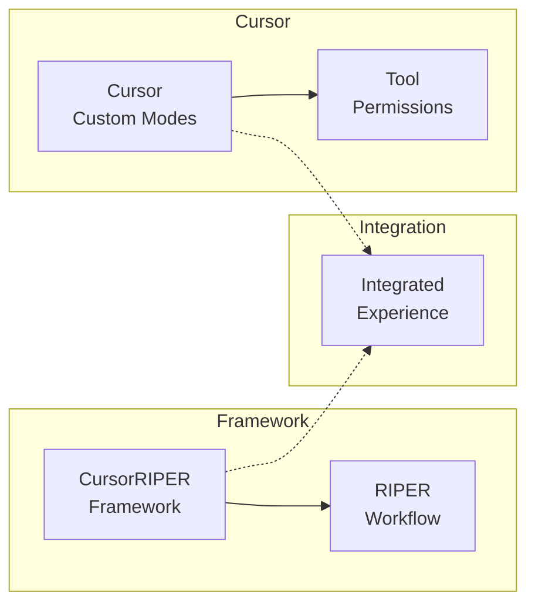

# CursorRIPER Framework - Custom Modes Guide

The CursorRIPER Framework can optionally be used with Cursor's Custom Modes feature for an enhanced user experience. This guide explains how to set up custom modes that align with the RIPER workflow.

## Custom Modes Overview

Cursor's Custom Modes feature allows you to create personalized AI assistant modes with specific tools and instructions. By configuring custom modes to match the RIPER workflow, you can enhance the framework with visual indicators and tool restrictions.



## Why Use Custom Modes

While the CursorRIPER Framework works perfectly without custom modes, integrating with Cursor's Custom Modes provides additional benefits:

1. **Visual Indicators**: Icons and visual cues for each mode
2. **Tool Permissions**: Proper tool restrictions for each mode
3. **Quick Access**: Easy switching via Cursor's mode dropdown
4. **Visual Feedback**: Clear indication of current mode
5. **Native Integration**: Seamless experience within Cursor

## Setting Up Custom Modes

To set up custom modes for the RIPER workflow:

1. **Enable Custom Modes**: 
   - Open Cursor Settings
   - Go to Features → Chat → Custom Modes
   - Toggle the feature on

2. **Create Each RIPER Mode**: For each mode, click "Add custom mode" and configure as follows:

### Research Mode

- **Name**: Research
- **Icon**: 🔍
- **Shortcut**: Ctrl+Alt+R (or your preference)
- **Tools**: 
  - ✅ Search Codebase
  - ✅ Read File
  - ✅ Search Files
  - ✅ Web Search
  - ❌ All other tools
- **Custom Instructions**: 
```
Only gather information and understand existing code. Do not make suggestions, implementations, or plans. Begin every response with [MODE: RESEARCH]. Only seek to understand what exists, not what could be. Ask clarifying questions when needed.
```

### Innovate Mode

- **Name**: Innovate
- **Icon**: 💡
- **Shortcut**: Ctrl+Alt+I
- **Tools**: 
  - ✅ Search Codebase
  - ✅ Read File
  - ✅ Search Files
  - ✅ Web Search
  - ❌ All other tools
- **Custom Instructions**: 
```
Brainstorm potential approaches without concrete planning or implementation. Present all ideas as possibilities, not decisions. Begin every response with [MODE: INNOVATE]. Discuss advantages and disadvantages of different approaches. Seek feedback on ideas.
```

### Plan Mode

- **Name**: Plan
- **Icon**: 📝
- **Shortcut**: Ctrl+Alt+P
- **Tools**: 
  - ✅ Search Codebase
  - ✅ Read File
  - ✅ Search Files
  - ✅ Web Search
  - ✅ Terminal (read-only)
  - ❌ All other tools
- **Custom Instructions**: 
```
Create detailed technical specifications without any implementation. Begin every response with [MODE: PLAN]. Ask clarifying questions first, then draft a comprehensive plan. Convert the plan into a numbered checklist of specific actions. Do not write or suggest code.
```

### Execute Mode

- **Name**: Execute
- **Icon**: ⚙️
- **Shortcut**: Ctrl+Alt+E
- **Tools**: 
  - ✅ Search Codebase
  - ✅ Read File
  - ✅ Search Files
  - ✅ Edit File
  - ✅ Create File
  - ✅ Terminal
  - ✅ Apply Edits
- **Custom Instructions**: 
```
Implement exactly what was planned in Plan mode, without deviation. Begin every response with [MODE: EXECUTE]. If any issues require deviation, immediately return to Plan mode. Mark items as complete as they are implemented. Track progress against the plan.
```

### Review Mode

- **Name**: Review
- **Icon**: 🔍
- **Shortcut**: Ctrl+Alt+V
- **Tools**: 
  - ✅ Search Codebase
  - ✅ Read File
  - ✅ Search Files
  - ❌ All other tools
- **Custom Instructions**: 
```
Validate implementation against the approved plan, explicitly flagging any deviations. Begin every response with [MODE: REVIEW]. Format deviation notices as ":warning: DEVIATION DETECTED: [description]". Conclude with explicit verdict on whether implementation matches plan exactly.
```

## Using Custom Modes with CursorRIPER

Once you've set up custom modes, you can use them alongside the CursorRIPER Framework:

1. **Select the appropriate mode** from Cursor's mode dropdown
2. **Use the framework commands** as normal (`/research`, `/innovate`, etc.)
3. **Framework state will update** to match the selected mode

The custom modes will enforce tool restrictions appropriate for each phase, while the framework will maintain state and memory bank updates.

## Future Integration

Cursor is considering adding a `.cursor/modes.json` file for project-specific mode configurations. Once this feature is available, the CursorRIPER Framework will include a pre-configured modes.json file that you can drop directly into your project.

## Custom Mode Limitations

Be aware of these limitations when using custom modes:

1. Custom modes are configured per-user, not per-project
2. Mode settings don't persist between different devices/installations
3. Custom modes may not be available in all versions of Cursor

If you prefer a more portable solution, continue using the core CursorRIPER Framework without custom modes, as it works independently of Cursor's mode system.

---

*The CursorRIPER Framework prevents coding disasters while maintaining perfect continuity across sessions.*
