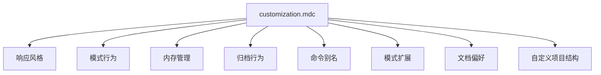

# CursorRIPER 框架 - 自定义指南

CursorRIPER框架设计为高度可定制，以匹配您的偏好和项目需求。本指南解释了如何通过`customization.mdc`文件自定义框架的行为。

## 自定义概述



## 自定义文件位置

自定义文件位于：
```
.cursor/rules/customization.mdc
```

此文件在核心框架组件加载后加载，可以覆盖默认行为。

## 自定义类别

### 1. 响应风格

控制AI助手如何与您沟通：

```
RESPONSE_VERBOSITY: "BALANCED"
```
可能的值：
- `"CONCISE"`: 简短、直接的响应，解释最少
- `"BALANCED"`: 适度细节，清晰解释（默认）
- `"DETAILED"`: 全面响应，带有广泛上下文

```
CODE_STYLE_PREFERENCES: ""
```
指定您的编码风格偏好，例如：
- 缩进（制表符vs空格，大小）
- 命名约定（camelCase、snake_case等）
- 行长度限制
- 括号放置
- 注释风格

```
EXPLANATION_LEVEL: "MEDIUM"
```
可能的值：
- `"MINIMAL"`: 代码功能的基本解释
- `"MEDIUM"`: 代码的平衡解释，包含关键实现细节（默认）
- `"COMPREHENSIVE"`: 代码所有方面的详细解释

### 2. 模式行为

自定义模式的操作和转换方式：

```
SUGGEST_MODE_TRANSITIONS: true
```
如果为`true`，AI可以建议何时适合进行模式转换。

```
AUTO_MODE_TRANSITION: false
```
如果为`true`，AI可以自动在模式间转换（除了EXECUTE）。
EXECUTE模式始终需要明确的用户授权。

```
PLAN_QUESTION_COUNT: 5
```
AI在PLAN模式中起草计划前会询问的澄清问题数量。

### 3. 内存管理

控制内存文件的更新方式和时间：

```
AUTO_UPDATE_MEMORY: true
```
如果为`true`，AI将在重大更改后自动更新内存文件。

```
MEMORY_UPDATE_FREQUENCY: "AFTER_COMPLETION"
```
可能的值：
- `"AFTER_EVERY_RESPONSE"`: 每次AI响应后更新
- `"AFTER_COMPLETION"`: 完成重要任务后更新（默认）
- `"MANUAL_ONLY"`: 仅在明确请求时更新

```
REQUIRED_MEMORY_FILES: ["projectbrief.md", "activeContext.md", "progress.md"]
```
框架正常运行必须存在的内存文件列表。

### 4. 归档行为

配置归档的工作方式：

```
AUTO_ARCHIVE_START_PHASE: true
```
如果为`true`，START阶段完成后将自动归档。

```
BACKUP_FREQUENCY: "DAILY"
```
可能的值：
- `"NEVER"`: 不创建自动备份
- `"DAILY"`: 每日创建备份（默认）
- `"WEEKLY"`: 每周创建备份
- `"BEFORE_CHANGES"`: 在重大更改前创建备份

```
KEEP_BACKUP_COUNT: 5
```
在删除最旧备份之前保留的备份集数量。

### 5. 命令别名

为模式转换命令创建快捷方式：

```
CUSTOM_COMMANDS: {
  "/r": "/research",
  "/i": "/innovate",
  "/p": "/plan",
  "/e": "/execute",
  "/rev": "/review"
}
```

为常用命令定义您自己的别名。

### 6. 模式扩展

为每个RIPER模式添加自定义行为：

```
RESEARCH_MODE_EXTENSIONS: []
INNOVATE_MODE_EXTENSIONS: []
PLAN_MODE_EXTENSIONS: []
EXECUTE_MODE_EXTENSIONS: []
REVIEW_MODE_EXTENSIONS: []
```

每个数组可以包含为相应模式定义额外行为的字符串。

### 7. 框架扩展

添加自定义阶段和工作流程：

```
CUSTOM_PHASES: []
```
标准阶段之外的额外项目阶段。

```
CUSTOM_WORKFLOWS: []
```
特定项目类型的自定义工作流程。

### 8. 文档偏好

配置文档的生成方式：

```
DOCUMENTATION_STYLE: "MARKDOWN"
```
生成文档的格式。

```
INCLUDE_CODE_COMMENTS: true
```
是否在生成的代码中包含详细注释。

```
CODE_BLOCK_LANGUAGE_TAGS: true
```
是否在代码块中包含语言标签。

### 9. AI输出格式

配置AI格式化响应的方式：

```
MODE_DECLARATION_FORMAT: "[MODE: {mode}]"
```
响应开始时模式声明的格式字符串。

```
PROGRESS_INDICATOR_FORMAT: "[{current_step}/{total_steps}]"
```
响应中进度指示器的格式。

### 10. 自定义项目结构

定义项目特定设置：

```
PROJECT_TYPE: "DEFAULT"
```
标识项目类型以进行专门处理。

```
CUSTOM_FOLDER_STRUCTURE: {}
```
项目脚手架的自定义文件夹结构定义。

```
TECHNOLOGY_PRESETS: {}
```
快速选择的预定义技术栈。

## 自定义示例

以下是常见自定义场景的示例：

### 示例1：简洁AI响应

```
RESPONSE_VERBOSITY: "CONCISE"
EXPLANATION_LEVEL: "MINIMAL"
```

此配置将使AI提供更短、更直接的响应，解释最少。

### 示例2：自动模式转换

```
SUGGEST_MODE_TRANSITIONS: true
AUTO_MODE_TRANSITION: true
```

这允许AI建议并自动执行模式转换（除了EXECUTE模式，始终需要明确授权）。

### 示例3：自定义命令快捷方式

```
CUSTOM_COMMANDS: {
  "/rs": "/research",
  "/in": "/innovate",
  "/pl": "/plan",
  "/ex": "/execute",
  "/rv": "/review",
  "/s": "/start"
}
```

这些快捷方式提供对模式转换的更快访问。

### 示例4：前端项目配置

```
PROJECT_TYPE: "FRONTEND"
TECHNOLOGY_PRESETS: {
  "FRONTEND": {
    "languages": ["JavaScript", "TypeScript", "HTML", "CSS"],
    "frameworks": ["React", "Vue", "Angular"],
    "buildTools": ["Webpack", "Vite"]
  }
}
```

前端项目的专门配置。

## 应用更改

要应用自定义设置的更改：

1. 使用您的首选设置编辑`.cursor/rules/customization.mdc`
2. 保存文件
3. 在Cursor IDE中开始新的聊天会话

AI助手将加载您的自定义设置，并在每个会话的第一个响应中确认活动的自定义。

## 恢复默认设置

要恢复默认设置：

1. 从`.cursor/rules/customization.mdc`删除自定义值
2. 替换为默认值或留空以使用框架默认值
3. 在Cursor IDE中开始新的聊天会话

## 高级自定义

对于高级用例，请考虑：

1. **自定义模式扩展**: 为特定项目类型创建专门行为
2. **自定义阶段**: 为专门的开发工作流程设计新阶段
3. **CI/CD集成**: 配置框架与您的CI/CD流水线协作
4. **自定义内存文件**: 为专门信息添加项目特定的内存文件

## 最佳实践

1. **从简单开始**: 从最小的自定义开始，根据需要添加更多
2. **记录更改**: 记录您自定义特定设置的原因
3. **版本控制**: 在版本控制中包含自定义文件以保持团队一致性
4. **定期审查**: 定期审查自定义以确保它们仍然满足您的需求
5. **团队对齐**: 确保团队成员了解并遵循自定义工作流程

---

*CursorRIPER框架防止编码灾难，同时在会话间保持完美连续性。* 