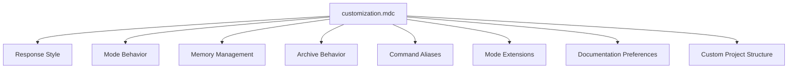

# CursorRIPER Framework - Customization Guide

The CursorRIPER Framework is designed to be highly customizable to match your preferences and project needs. This guide explains how to customize the framework's behavior through the `customization.mdc` file.

## Customization Overview



## Customization File Location

The customization file is located at:
```
.cursor/rules/customization.mdc
```

This file is loaded after core framework components and can override default behaviors.

## Customization Categories

### 1. Response Style

Control how the AI assistant communicates with you:

```
RESPONSE_VERBOSITY: "BALANCED"
```
Possible values:
- `"CONCISE"`: Short, direct responses with minimal explanation
- `"BALANCED"`: Moderate detail with clear explanations (default)
- `"DETAILED"`: Comprehensive responses with extensive context

```
CODE_STYLE_PREFERENCES: ""
```
Specify your coding style preferences, such as:
- Indentation (tabs vs. spaces, size)
- Naming conventions (camelCase, snake_case, etc.)
- Line length limitations
- Bracket placement
- Comment style

```
EXPLANATION_LEVEL: "MEDIUM"
```
Possible values:
- `"MINIMAL"`: Basic explanation of code functionality
- `"MEDIUM"`: Balanced explanation of code with key implementation details (default)
- `"COMPREHENSIVE"`: Detailed explanation of all aspects of the code

### 2. Mode Behavior

Customize how modes operate and transition:

```
SUGGEST_MODE_TRANSITIONS: true
```
If `true`, the AI can suggest when a mode transition might be appropriate.

```
AUTO_MODE_TRANSITION: false
```
If `true`, the AI can automatically transition between modes (except to EXECUTE).
EXECUTE mode always requires explicit user authorization.

```
PLAN_QUESTION_COUNT: 5
```
Number of clarifying questions the AI will ask in PLAN mode before drafting a plan.

### 3. Memory Management

Control how and when memory files are updated:

```
AUTO_UPDATE_MEMORY: true
```
If `true`, the AI will automatically update memory files after significant changes.

```
MEMORY_UPDATE_FREQUENCY: "AFTER_COMPLETION"
```
Possible values:
- `"AFTER_EVERY_RESPONSE"`: Update after each AI response
- `"AFTER_COMPLETION"`: Update after completing a significant task (default)
- `"MANUAL_ONLY"`: Only update when explicitly requested

```
REQUIRED_MEMORY_FILES: ["projectbrief.md", "activeContext.md", "progress.md"]
```
List of memory files that must exist for the framework to function properly.

### 4. Archive Behavior

Configure how archiving works:

```
AUTO_ARCHIVE_START_PHASE: true
```
If `true`, the START phase will be automatically archived upon completion.

```
BACKUP_FREQUENCY: "DAILY"
```
Possible values:
- `"NEVER"`: Don't create automatic backups
- `"DAILY"`: Create backups daily (default)
- `"WEEKLY"`: Create backups weekly
- `"BEFORE_CHANGES"`: Create backups before making significant changes

```
KEEP_BACKUP_COUNT: 5
```
Number of backup sets to retain before deleting the oldest.

### 5. Command Aliases

Create shortcuts for mode transition commands:

```
CUSTOM_COMMANDS: {
  "/r": "/research",
  "/i": "/innovate",
  "/p": "/plan",
  "/e": "/execute",
  "/rev": "/review"
}
```

Define your own aliases for frequently used commands.

### 6. Mode Extensions

Add custom behaviors to each RIPER mode:

```
RESEARCH_MODE_EXTENSIONS: []
INNOVATE_MODE_EXTENSIONS: []
PLAN_MODE_EXTENSIONS: []
EXECUTE_MODE_EXTENSIONS: []
REVIEW_MODE_EXTENSIONS: []
```

Each array can contain strings that define additional behaviors for the respective mode.

### 7. Framework Extensions

Add custom phases and workflows:

```
CUSTOM_PHASES: []
```
Additional project phases beyond the standard ones.

```
CUSTOM_WORKFLOWS: []
```
Custom workflows for specific project types.

### 8. Documentation Preferences

Configure how documentation is generated:

```
DOCUMENTATION_STYLE: "MARKDOWN"
```
Format for generated documentation.

```
INCLUDE_CODE_COMMENTS: true
```
Whether to include detailed comments in generated code.

```
CODE_BLOCK_LANGUAGE_TAGS: true
```
Whether to include language tags in code blocks.

### 9. AI Output Format

Configure how the AI formats its responses:

```
MODE_DECLARATION_FORMAT: "[MODE: {mode}]"
```
Format string for mode declarations at the start of responses.

```
PROGRESS_INDICATOR_FORMAT: "[{current_step}/{total_steps}]"
```
Format for progress indicators in responses.

### 10. Custom Project Structure

Define project-specific settings:

```
PROJECT_TYPE: "DEFAULT"
```
Identifies the type of project for specialized handling.

```
CUSTOM_FOLDER_STRUCTURE: {}
```
Custom folder structure definitions for project scaffolding.

```
TECHNOLOGY_PRESETS: {}
```
Predefined technology stacks for quick selection.

## Customization Examples

Here are examples of common customization scenarios:

### Example 1: Concise AI Responses

```
RESPONSE_VERBOSITY: "CONCISE"
EXPLANATION_LEVEL: "MINIMAL"
```

This configuration will make the AI provide shorter, more direct responses with minimal explanations.

### Example 2: Automatic Mode Transitions

```
SUGGEST_MODE_TRANSITIONS: true
AUTO_MODE_TRANSITION: true
```

This allows the AI to suggest and automatically perform mode transitions (except to EXECUTE mode, which always requires explicit authorization).

### Example 3: Custom Command Shortcuts

```
CUSTOM_COMMANDS: {
  "/rs": "/research",
  "/in": "/innovate",
  "/pl": "/plan",
  "/ex": "/execute",
  "/rv": "/review",
  "/s": "/start"
}
```

These shortcuts provide quicker access to mode transitions.

### Example 4: Frontend Project Configuration

```
PROJECT_TYPE: "FRONTEND"
TECHNOLOGY_PRESETS: {
  "FRONTEND": {
    "languages": ["JavaScript", "TypeScript", "HTML", "CSS"],
    "frameworks": ["React", "Vue", "Angular"],
    "buildTools": ["Webpack", "Vite"]
  }
}
```

Specialized configuration for frontend projects.

## Applying Changes

To apply changes to your customization settings:

1. Edit `.cursor/rules/customization.mdc` with your preferred settings
2. Save the file
3. Start a new chat session in Cursor IDE

The AI assistant will load your custom settings and acknowledge the active customizations in its first response of each session.

## Restoring Default Settings

To restore default settings:

1. Delete the custom values from `.cursor/rules/customization.mdc`
2. Replace with default values or leave blank to use framework defaults
3. Start a new chat session in Cursor IDE

## Advanced Customization

For advanced use cases, consider:

1. **Custom Mode Extensions**: Create specialized behaviors for specific project types
2. **Custom Phases**: Design new phases for specialized development workflows
3. **Integration with CI/CD**: Configure the framework to work with your CI/CD pipeline
4. **Custom Memory Files**: Add project-specific memory files for specialized information

## Best Practices

1. **Start Simple**: Begin with minimal customization and add more as needed
2. **Document Changes**: Note why you've customized specific settings
3. **Version Control**: Include customization file in version control for team consistency
4. **Regular Review**: Periodically review customizations to ensure they still meet your needs
5. **Team Alignment**: Ensure team members understand and follow customized workflows

---

*The CursorRIPER Framework prevents coding disasters while maintaining perfect continuity across sessions.*
