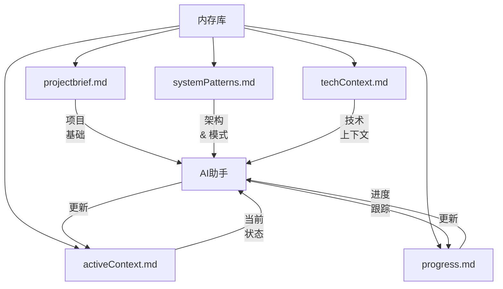

# CursorRIPER 框架 - 内存库指南

内存库是CursorRIPER框架的核心组件，在编码会话中提供持久化上下文。本指南解释了如何有效使用和维护您的内存库。

## 内存库概述



## 核心内存文件

### projectbrief.md

**目的**: 定义项目的核心需求和目标。

**关键部分**:
- 项目概述
- 核心需求
- 成功标准
- 范围（包含/排除）
- 时间表
- 利益相关者

**何时更新**:
- 在项目开始时
- 当主要需求变化时
- 当项目范围演变时

### systemPatterns.md

**目的**: 记录系统架构和设计模式。

**关键部分**:
- 架构概述
- 关键组件
- 使用中的设计模式
- 数据流
- 关键技术决策
- 组件关系

**何时更新**:
- 在架构决策后
- 建立新模式时
- 组件关系变化时

### techContext.md

**目的**: 描述使用的技术和开发设置。

**关键部分**:
- 技术栈
- 开发环境设置
- 依赖项
- 技术约束
- 构建和部署
- 测试方法

**何时更新**:
- 添加新技术时
- 更新依赖项后
- 改变构建过程时
- 修改开发环境时

### activeContext.md

**目的**: 跟踪当前工作焦点和即时下一步。

**关键部分**:
- 当前焦点
- 最近更改
- 活跃决策
- 下一步
- 当前挑战
- 实施进度

**何时更新**:
- 在每个工作会话开始时
- 完成重要任务后
- 切换焦点区域时
- 遇到新挑战时

### progress.md

**目的**: 跟踪什么有效、什么在进行中、什么还需要构建。

**关键部分**:
- 项目状态
- 什么有效
- 什么在进行中
- 什么还需要构建
- 已知问题
- 里程碑

**何时更新**:
- 完成功能后
- 开始新工作时
- 发现问题时
- 达到里程碑时

## 内存库管理

### 自动更新

框架可以根据您的自定义设置自动更新内存文件：

- `AUTO_UPDATE_MEMORY`: 控制是否启用自动更新
- `MEMORY_UPDATE_FREQUENCY`: 控制更新发生的时间

### 手动更新

您可以通过以下方式手动更新内存文件：

1. 直接编辑文件
2. 要求AI更新特定文件
3. 使用内存库更新命令

示例：
```
请更新progress.md文件以反映我们已完成用户身份验证功能。
```

### 内存库最佳实践

1. **保持信息最新**
   - 定期更新activeContext.md和progress.md
   - 确保技术决策在systemPatterns.md中记录
   - 随着项目需求的发展更新projectbrief.md

2. **使用一致的格式**
   - 遵循每种文件类型的模板
   - 一致使用markdown格式
   - 为所有更新包含日期

3. **在更新中保持具体**
   - 包含具体的文件路径、函数名称和组件名称
   - 用详细描述记录问题
   - 在文件间链接相关项目

4. **维护版本历史**
   - 在内存文件中包含版本号
   - 进行更改时更新"最后更新"时间戳
   - 跟踪重大修订

5. **逻辑组织信息**
   - 使用清晰的部分标题
   - 将相关信息分组
   - 为属于一起的项目使用列表

## 内存库和RIPER工作流程

每个RIPER模式以特定方式与内存库交互：

### RESEARCH 模式
- 读取: projectbrief.md, systemPatterns.md, techContext.md
- 更新: activeContext.md中的新发现

### INNOVATE 模式
- 读取: 所有内存文件
- 更新: systemPatterns.md中的设计替代方案和决策

### PLAN 模式
- 读取: 所有内存文件
- 更新: activeContext.md中的计划更改，progress.md中的预期结果

### EXECUTE 模式
- 读取: 所有内存文件
- 更新: activeContext.md中的进度，progress.md中的完成项目

### REVIEW 模式
- 读取: 所有内存文件
- 更新: progress.md中的审查结果，activeContext.md中的审查状态

## 故障排除

如果您的内存库遇到问题：

1. **缺少信息**
   - 检查文件是否存在于memory-bank目录中
   - 验证文件权限
   - 必要时重新运行内存库初始化

2. **过时信息**
   - 更新时间戳和版本号
   - 审查并更新所有相关部分的内容
   - 考虑完整的内存库刷新

3. **不一致信息**
   - 跨内存文件交叉引用
   - 进行更改时更新所有相关文件
   - 请求AI帮助协调不一致性

4. **文件损坏**
   - 从备份恢复
   - 必要时从模板重新生成文件
   - 请求AI帮助重新创建缺失信息

---

*CursorRIPER框架防止编码灾难，同时在会话间保持完美连续性。* 