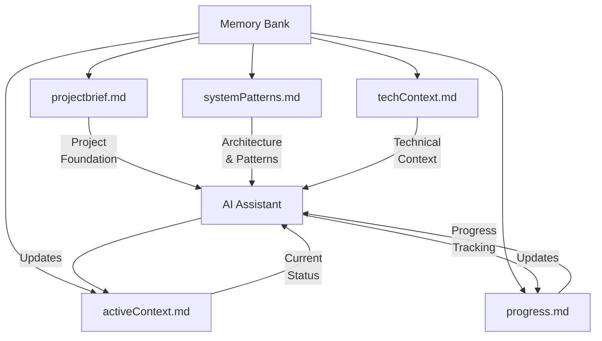

# CursorRIPER Framework - Memory Bank Guide

The Memory Bank is a core component of the CursorRIPER Framework, providing persistent context across coding sessions. This guide explains how to effectively use and maintain your Memory Bank.

## Memory Bank Overview



## Core Memory Files

### projectbrief.md

**Purpose**: Defines core requirements and goals of the project.

**Key Sections**:
- Project Overview
- Core Requirements
- Success Criteria
- Scope (In/Out)
- Timeline
- Stakeholders

**When to Update**:
- At the beginning of the project
- When major requirements change
- When project scope evolves

### systemPatterns.md

**Purpose**: Documents system architecture and design patterns.

**Key Sections**:
- Architecture Overview
- Key Components
- Design Patterns in Use
- Data Flow
- Key Technical Decisions
- Component Relationships

**When to Update**:
- After architectural decisions
- When new patterns are established
- When component relationships change

### techContext.md

**Purpose**: Describes technologies used and development setup.

**Key Sections**:
- Technology Stack
- Development Environment Setup
- Dependencies
- Technical Constraints
- Build and Deployment
- Testing Approach

**When to Update**:
- When adding new technologies
- After updating dependencies
- When changing build processes
- When modifying development environment

### activeContext.md

**Purpose**: Tracks current work focus and immediate next steps.

**Key Sections**:
- Current Focus
- Recent Changes
- Active Decisions
- Next Steps
- Current Challenges
- Implementation Progress

**When to Update**:
- At the start of each work session
- After completing significant tasks
- When switching focus areas
- When encountering new challenges

### progress.md

**Purpose**: Tracks what works, what's in progress, and what's left to build.

**Key Sections**:
- Project Status
- What Works
- What's In Progress
- What's Left To Build
- Known Issues
- Milestones

**When to Update**:
- After completing features
- When starting new work
- When discovering issues
- When reaching milestones

## Memory Bank Management

### Automatic Updates

The framework can automatically update memory files based on your customization settings:

- `AUTO_UPDATE_MEMORY`: Controls whether automatic updates are enabled
- `MEMORY_UPDATE_FREQUENCY`: Controls when updates occur

### Manual Updates

You can manually update memory files by:

1. Editing the files directly
2. Asking the AI to update specific files
3. Using the memory bank update command

Example:
```
Please update the progress.md file to reflect that we've completed the user authentication feature.
```

### Memory Bank Best Practices

1. **Keep Information Current**
   - Regularly update activeContext.md and progress.md
   - Ensure technical decisions are documented in systemPatterns.md
   - Update project requirements in projectbrief.md as they evolve

2. **Use Consistent Formatting**
   - Follow the templates for each file type
   - Use markdown formatting consistently
   - Include dates for all updates

3. **Be Specific in Updates**
   - Include specific file paths, function names, and component names
   - Document issues with detailed descriptions
   - Link related items across files

4. **Maintain Version History**
   - Include version numbers in memory files
   - Update the "Last Updated" timestamp when making changes
   - Track major revisions

5. **Organize Information Logically**
   - Use clear section headers
   - Group related information together
   - Use lists for items that belong together

## Memory Bank and RIPER Workflow

Each RIPER mode interacts with the Memory Bank in specific ways:

### RESEARCH Mode
- Reads from: projectbrief.md, systemPatterns.md, techContext.md
- Updates: activeContext.md with new discoveries

### INNOVATE Mode
- Reads from: all memory files
- Updates: systemPatterns.md with design alternatives and decisions

### PLAN Mode
- Reads from: all memory files
- Updates: activeContext.md with planned changes, progress.md with expected outcomes

### EXECUTE Mode
- Reads from: all memory files
- Updates: activeContext.md with progress, progress.md with completed items

### REVIEW Mode
- Reads from: all memory files
- Updates: progress.md with review findings, activeContext.md with review status

## Troubleshooting [Guide Link](troubleshooting-guide.md)

If you encounter issues with your Memory Bank:

1. **Missing Information**
   - Check if files exist in the memory-bank directory
   - Verify file permissions
   - Re-run memory bank initialization if necessary

2. **Outdated Information**
   - Update timestamp and version number
   - Review and update content in all relevant sections
   - Consider a full memory bank refresh

3. **Inconsistent Information**
   - Cross-reference across memory files
   - Update all related files when making changes
   - Ask the AI to help reconcile inconsistencies

4. **File Corruption**
   - Restore from backups
   - Regenerate files from templates if necessary
   - Ask the AI to help recreate missing information

---

*The CursorRIPER Framework prevents coding disasters while maintaining perfect continuity across sessions.*
