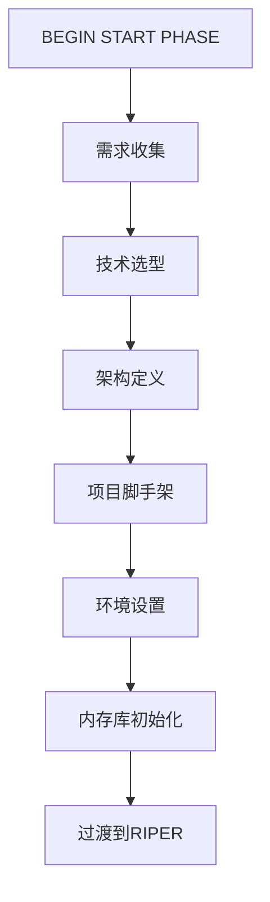

# CursorRIPER 框架 - START阶段指南

START阶段是一个一次性的初始化过程，用于设置您的项目和内存库。本指南解释了如何进行START阶段的每个步骤。

## START阶段概述



## 启动START阶段

在Cursor IDE聊天中使用以下命令开始START阶段：

```
/start
```

或者

```
BEGIN START PHASE
```

## 步骤1：需求收集

在此步骤中，AI将通过提出关键问题来帮助您记录项目需求：

- 这个项目要解决什么问题？
- 主要用户或利益相关者是谁？
- 必须具备的功能有哪些？
- 希望具备的功能有哪些？
- 技术约束是什么？
- 完成的时间表是什么？

### 需求收集提示

1. 尽可能具体地描述您的项目目标
2. 将功能分为必须具备和希望具备的类别
3. 考虑用户画像及其需求
4. 尽早考虑技术约束
5. 设定现实的时间表期望

### 输出

此步骤收集的信息将用于在内存库中创建`projectbrief.md`。

## 步骤2：技术选型

AI将通过以下问题帮助您为项目选择合适的技术：

- 哪种编程语言最适合这个项目？
- 应该使用哪些框架或库？
- 应该使用什么数据库技术？
- 目标部署环境是什么？
- 是否有特定的性能要求？
- 应该使用哪些测试框架？

### 技术选型提示

1. 考虑您的团队对不同技术的专业知识
2. 评估每个选项的长期支持和社区
3. 选择与项目规模和复杂性相匹配的技术
4. 考虑与现有系统的集成
5. 考虑托管和部署要求

### 输出

技术决策将在`techContext.md`中记录。

## 步骤3：架构定义

AI将通过以下问题帮助您定义系统架构：

- 哪种架构模式最合适？
- 应用程序将如何结构化？
- 关键组件及其职责是什么？
- 数据如何在系统中流动？
- 系统如何扩展？
- 需要考虑哪些安全问题？

### 架构定义提示

1. 绘制图表来可视化组件关系
2. 定义组件之间的清晰边界
3. 从一开始就规划可扩展性
4. 在架构层面考虑安全性
5. 记录关键架构决策及其理由

### 输出

架构将在`systemPatterns.md`中记录。

## 步骤4：项目脚手架

AI将帮助您设置初始项目结构：

- 创建基本文件夹结构
- 初始化git存储库
- 设置包管理
- 创建初始配置文件
- 设置基本构建过程

### 项目脚手架提示

1. 为您选择的技术遵循行业标准项目结构
2. 从一开始就正确设置.gitignore
3. 尽早配置lint和格式化工具
4. 创建带有清晰设置说明的README.md
5. 考虑为常见文件使用模板

## 步骤5：环境设置

AI将帮助您配置开发环境：

- 设置本地开发环境
- 配置测试框架
- 创建初始测试用例
- 定义CI/CD流水线
- 记录部署过程

### 环境设置提示

1. 使用容器化确保环境一致性
2. 从一开始就设置自动化测试
3. 记录环境变量
4. 尽早配置CI/CD流水线
5. 创建开发、暂存和生产配置

## 步骤6：内存库初始化

AI将创建并填充所有核心内存文件：

- `projectbrief.md`（如果尚未创建）
- `systemPatterns.md`（如果尚未创建）
- `techContext.md`（如果尚未创建）
- `activeContext.md`
- `progress.md`

### 内存库初始化提示

1. 审查所有内存文件的准确性
2. 在需要的地方添加额外细节
3. 确保所有部分都得到适当填充
4. 设置现实的初始进度指标
5. 在activeContext.md中定义清晰的下一步

## 过渡到RIPER工作流程

完成所有六个步骤后，框架将：

1. 验证所有内存文件都已正确创建和填充
2. 更新状态从INITIALIZING过渡到DEVELOPMENT
3. 归档START阶段
4. 自动过渡到RESEARCH模式
5. 通知您项目初始化完成

然后您可以开始使用RIPER工作流程进行开发过程。

---

*CursorRIPER框架防止编码灾难，同时在会话间保持完美连续性。* 