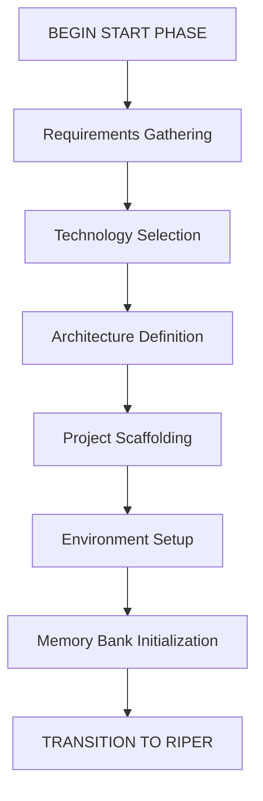

# CursorRIPER Framework - START Phase Guide

The START phase is a one-time initialization process that sets up your project and memory bank. This guide explains how to work through each step of the START phase.

## START Phase Overview



## Initiating the START Phase

To begin the START phase, use one of these commands in the Cursor IDE chat:

```
/start
```

or

```
BEGIN START PHASE
```

## Step 1: Requirements Gathering

In this step, the AI will help you document your project requirements by asking key questions:

- What problem is this project trying to solve?
- Who are the primary users or stakeholders?
- What are the must-have features?
- What are the nice-to-have features?
- What are the technical constraints?
- What is the timeline for completion?

### Tips for Requirements Gathering

1. Be as specific as possible about your project goals
2. Prioritize features into must-have and nice-to-have categories
3. Consider user personas and their needs
4. Think about technical constraints early
5. Set realistic timeline expectations

### Output

The information gathered in this step will be used to create `projectbrief.md` in your memory bank.

## Step 2: Technology Selection

The AI will help you select appropriate technologies for your project by asking:

- What programming language(s) best fit this project?
- What frameworks or libraries would be most appropriate?
- What database technology should be used?
- What deployment environment is targeted?
- Are there any specific performance requirements?
- What testing frameworks should be used?

### Tips for Technology Selection

1. Consider your team's expertise with different technologies
2. Evaluate the long-term support and community around each option
3. Choose technologies that align with your project's scale and complexity
4. Consider integration with existing systems
5. Think about hosting and deployment requirements

### Output

Technology decisions will be documented in `techContext.md`.

## Step 3: Architecture Definition

The AI will help you define your system architecture by asking:

- What architectural pattern is most appropriate?
- How will the application be structured?
- What are the key components and their responsibilities?
- How will data flow through the system?
- How will the system scale?
- What security considerations need to be addressed?

### Tips for Architecture Definition

1. Draw diagrams to visualize component relationships
2. Define clear boundaries between components
3. Plan for scalability from the beginning
4. Consider security at the architectural level
5. Document key architectural decisions with rationales

### Output

The architecture will be documented in `systemPatterns.md`.

## Step 4: Project Scaffolding

The AI will help you set up the initial project structure:

- Create the basic folder structure
- Initialize git repository
- Set up package management
- Create initial configuration files
- Set up basic build process

### Tips for Project Scaffolding

1. Follow industry-standard project structures for your chosen technology
2. Set up .gitignore properly from the beginning
3. Configure linting and formatting tools early
4. Create README.md with clear setup instructions
5. Consider using templates for common files

## Step 5: Environment Setup

The AI will help you configure your development environment:

- Set up local development environment
- Configure testing framework
- Create initial test cases
- Define CI/CD pipeline
- Document deployment process

### Tips for Environment Setup

1. Use containerization to ensure consistent environments
2. Set up automated testing from the start
3. Document environment variables
4. Configure CI/CD pipelines early
5. Create development, staging, and production configurations

## Step 6: Memory Bank Initialization

The AI will create and populate all core memory files:

- `projectbrief.md` (if not already created)
- `systemPatterns.md` (if not already created)
- `techContext.md` (if not already created)
- `activeContext.md`
- `progress.md`

### Tips for Memory Bank Initialization

1. Review all memory files for accuracy
2. Add additional details where needed
3. Ensure all sections are appropriately filled out
4. Set realistic initial progress metrics
5. Define clear next steps in activeContext.md

## Transitioning to RIPER Workflow

Once all six steps are completed, the framework will:

1. Verify all memory files are properly created and populated
2. Update state to transition from INITIALIZING to DEVELOPMENT
3. Archive the START phase
4. Automatically transition to RESEARCH mode
5. Inform you that project initialization is complete

You can then begin using the RIPER workflow for your development process.

---

*The CursorRIPER Framework prevents coding disasters while maintaining perfect continuity across sessions.*
