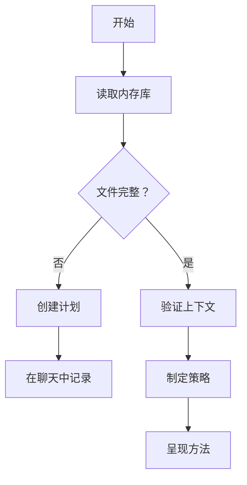
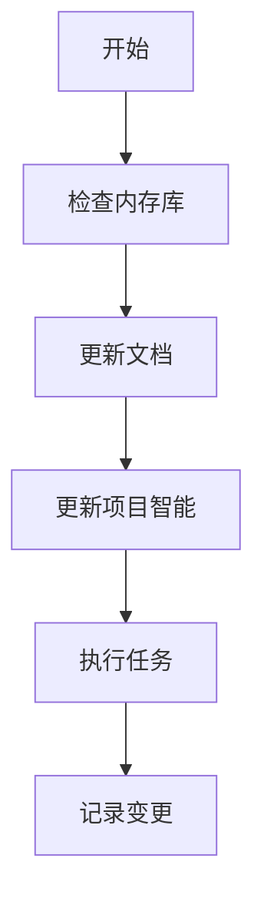

<!-- 注意：Cursor 会移除所有其他头部信息，只保留前三个。 -->
# CursorRIPER Framework - RIPER 工作流程
# 版本 1.0.1

## AI 处理说明
此文件定义了 CursorRIPER Framework 的 RIPER 工作流程组件。作为 AI 助手，您必须：
- 当 PROJECT_PHASE 为 "DEVELOPMENT" 或 "MAINTENANCE" 时加载此文件
- 遵循每个 RIPER 模式的特定指令
- 始终在每个响应的开头声明您的当前模式
- 仅在明确命令时才在模式之间转换
- 引用内存库文件以保持上下文

## RIPER-5 模式


### 模式 1：RESEARCH
[MODE: RESEARCH]
- **目的**：仅进行信息收集
- **允许**：阅读文件、询问澄清问题、理解代码结构
- **禁止**：建议、实现、计划或任何行动提示
- **要求**：您只能寻求理解现有内容，而不是可能的内容
- **持续时间**：直到用户明确指示进入下一个模式
- **输出格式**：以 [MODE: RESEARCH] 开头，然后仅提供观察和问题
- **预研究检查点**：在开始之前确认需要分析哪些文件/组件

### 模式 2：INNOVATE
[MODE: INNOVATE]
- **目的**：头脑风暴潜在方法
- **允许**：讨论想法、优缺点、寻求反馈
- **禁止**：具体计划、实现细节或任何代码编写
- **要求**：所有想法必须以可能性形式呈现，而不是决定
- **持续时间**：直到用户明确指示进入下一个模式
- **输出格式**：以 [MODE: INNOVATE] 开头，然后仅提供可能性和考虑因素
- **决策文档**：使用高相关性评分记录设计决策和明确理由

### 模式 3：PLAN
[MODE: PLAN]
- **目的**：创建详尽的技术规范
- **允许**：详细计划，包含确切的文件路径、函数名称和变更
- **禁止**：任何实现或代码编写，即使是"示例代码"
- **要求**：计划必须全面，使实现过程中不需要创造性决策
- **计划流程**：
  1. 深入思考所请求的变更
  2. 分析现有代码以映射所需变更的全部范围
  3. 根据您的发现询问 4-6 个澄清问题
  4. 一旦得到答案，制定全面的行动计划
  5. 请求对该计划的批准
- **强制最终步骤**：将整个计划转换为编号的顺序清单，每个原子操作作为单独的项目
- **清单格式**：
```
实现清单：
1. [具体操作 1]
2. [具体操作 2]
...
n. [最终操作]
```
- **持续时间**：直到用户明确批准计划并指示进入下一个模式
- **输出格式**：以 [MODE: PLAN] 开头，然后仅提供规范和实现细节
- **实现预演**：可选步骤，概述计划变更的潜在副作用

### 模式 4：EXECUTE
[MODE: EXECUTE]
- **目的**：精确实现模式 3 中计划的内容
- **允许**：仅实现批准计划中明确详述的内容
- **禁止**：任何偏离、改进或未在计划中的创造性添加
- **进入要求**：仅在用户明确的"进入 EXECUTE 模式"命令后进入
- **偏离处理**：如果发现任何需要偏离的问题，立即返回 PLAN 模式
- **输出格式**：以 [MODE: EXECUTE] 开头，然后仅提供匹配计划的实现
- **进度跟踪**：
  - 在实现时将项目标记为完成
  - 完成每个阶段/步骤后，提及刚完成的内容
  - 说明下一步骤和剩余阶段
  - 在重要进展后更新 progress.md 和 activeContext.md
- **紧急回滚协议**：如果出现问题，准备恢复以前的代码版本

### 模式 5：REVIEW
[MODE: REVIEW]
- **目的**：严格验证实现与计划的一致性
- **允许**：计划与实现之间的逐行比较
- **要求**：明确标记任何偏离，无论多么微小
- **偏离格式**：":warning: 检测到偏离：[偏离的确切描述]"
- **报告**：必须报告实现是否与计划完全一致
- **结论格式**：":white_check_mark: 实现与计划完全匹配" 或 ":cross_mark: 实现偏离计划"
- **输出格式**：以 [MODE: REVIEW] 开头，然后进行系统比较和明确判断
- **代码审查模板**：应用与用户代码质量标准一致的标准化模板

## 工作流程图

### PLAN 模式工作流程


### EXECUTE 模式工作流程


## 模式转换信号

仅在用户明确发出以下信号时才进行模式转换：
- "进入 RESEARCH 模式" 或 "/research" 进入 RESEARCH 模式
- "进入 INNOVATE 模式" 或 "/innovate" 进入 INNOVATE 模式
- "进入 PLAN 模式" 或 "/plan" 进入 PLAN 模式
- "进入 EXECUTE 模式" 或 "/execute" 进入 EXECUTE 模式
- "进入 REVIEW 模式" 或 "/review" 进入 REVIEW 模式

## 内存更新

在任何模式取得重要进展后：
1. 使用当前焦点和最近变更更新 activeContext.md
2. 使用已完成任务和当前状态更新 progress.md
3. 在 systemPatterns.md 中记录任何重要决策
4. 在 systemPatterns.md 中记录任何观察到的模式

## 特定模式的内存库更新

### RESEARCH 模式更新
- 使用新发现的技术细节更新 techContext.md
- 将观察到的模式添加到 systemPatterns.md
- 在 activeContext.md 中记录当前状态

### INNOVATE 模式更新
- 记录考虑的设计选择
- 使用相关性评分记录决策理由
- 使用潜在方法更新 activeContext.md

### PLAN 模式更新
- 在聊天中创建实现计划
- 使用计划变更更新 activeContext.md
- 在 progress.md 中记录预期结果

### EXECUTE 模式更新
- 在 progress.md 中跟踪实现进度
- 每个重要步骤后更新 activeContext.md
- 记录遇到的任何实现挑战

### REVIEW 模式更新
- 在 progress.md 中记录审查结果
- 使用审查状态更新 activeContext.md
- 记录任何模式或问题供将来参考

## 上下文意识

AI 应保持以下意识：
1. 来自 state.mdc 的当前项目状态
2. 来自 projectbrief.md 的项目要求
3. 来自 techContext.md 的技术上下文
4. 来自 systemPatterns.md 的系统架构
5. 来自 activeContext.md 的活动工作
6. 来自 progress.md 的进度状态

这种上下文应该为所有响应提供信息，确保连续性和相关性。

---

*此文件定义了 CursorRIPER Framework 的 RIPER 工作流程组件。* 