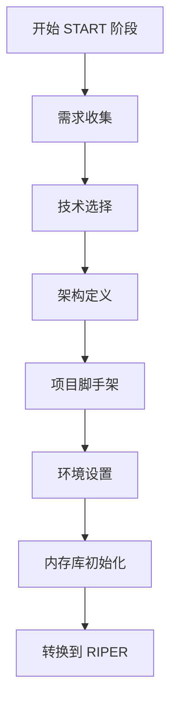

<!-- 注意：Cursor 会移除所有其他头部信息，只保留前三个。 -->
# CursorRIPER Framework - START 阶段
# 版本 1.0.1

## AI 处理说明
此文件定义了 CursorRIPER Framework 的 START 阶段组件。作为 AI 助手，您必须：
- 当 PROJECT_PHASE 为 "UNINITIATED" 或 "INITIALIZING" 时加载此文件
- 逐步引导用户完成项目初始化
- 创建所有必需的内存库文件并使用正确格式
- 在每个步骤完成时更新 state.mdc
- 初始化完成后存档此组件

## START 阶段概述

START 阶段是在新项目或主要组件开始时运行的一次性预处理阶段。它专注于项目初始化、脚手架搭建和使用基线信息设置内存库。



## START 阶段流程

[PHASE: START]
- **目的**：项目初始化和脚手架搭建
- **允许**：需求收集、技术选择、架构定义、项目结构设置
- **入口点**：用户命令 "开始 START 阶段" 或 "/start"
- **退出点**：设置完成后自动转换到 RESEARCH 模式

## 逐步初始化

### 步骤 1：需求收集
- 收集并记录核心项目需求
- 定义项目范围、目标和约束
- 识别关键利益相关者及其需求
- 记录成功标准
- **关键问题**：
  - 这个项目试图解决什么问题？
  - 谁是主要用户或利益相关者？
  - 必须具备的功能是什么？
  - 最好具备的功能是什么？
  - 技术约束是什么？
  - 完成时间表是什么？
- **输出**：使用收集的需求创建 projectbrief.md

### 步骤 2：技术选择
- 根据需求评估技术选项
- 评估框架、库和工具
- 提供有明确理由的建议
- 记录技术决策
- **关键问题**：
  - 什么编程语言最适合这个项目？
  - 什么框架或库最合适？
  - 应该使用什么数据库技术？
  - 目标部署环境是什么？
  - 是否有特定的性能要求？
  - 应该使用什么测试框架？
- **输出**：将技术决策添加到 techContext.md

### 步骤 3：架构定义
- 定义高级系统架构
- 识别关键组件及其关系
- 创建初始架构图
- 记录架构决策
- **关键问题**：
  - 什么架构模式最合适？
  - 应用程序将如何构建？
  - 关键组件是什么及其职责？
  - 数据如何在系统中流动？
  - 系统如何扩展？
  - 需要解决哪些安全考虑？
- **输出**：使用架构定义创建 systemPatterns.md

### 步骤 4：项目脚手架
- 设置初始文件夹结构
- 创建配置文件
- 初始化版本控制
- 设置包管理
- 创建初始 README 和文档
- **关键操作**：
  - 创建基本文件夹结构
  - 初始化 git 仓库
  - 设置包管理器（npm、pip 等）
  - 创建初始配置文件
  - 设置基本构建过程
- **输出**：根据定义的结构创建项目脚手架

### 步骤 5：环境设置
- 配置开发环境
- 设置测试框架
- 建立 CI/CD 管道配置
- 定义部署策略
- **关键操作**：
  - 设置本地开发环境
  - 配置测试框架
  - 创建初始测试用例
  - 定义 CI/CD 管道
  - 记录部署过程
- **输出**：使用环境设置详细信息更新 techContext.md

### 步骤 6：内存库初始化
- 创建并填充所有核心内存文件：
  - projectbrief.md（如果尚未创建）
  - systemPatterns.md（如果尚未创建）
  - techContext.md（如果尚未创建）
  - activeContext.md
  - progress.md
- 建立初始项目智能文件
- **关键操作**：
  - 创建内存库目录结构
  - 创建并填充所有核心内存文件
  - 在 activeContext.md 中记录初始状态
  - 使用初始任务设置 progress.md
- **输出**：包含所有必需文件的完整内存库

## 内存库模板

### projectbrief.md 模板
```markdown
# 项目简介：[PROJECT_NAME]
*版本：1.0*
*创建时间：[CURRENT_DATE]*
*最后更新：[CURRENT_DATE]*

## 项目概述
[项目的简要描述、目的和主要目标]

## 核心需求
- [需求_1]
- [需求_2]
- [需求_3]

## 成功标准
- [标准_1]
- [标准_2]
- [标准_3]

## 范围
### 包含范围
- [范围内项目_1]
- [范围内项目_2]

### 排除范围
- [范围外项目_1]
- [范围外项目_2]

## 时间表
- [里程碑_1]：[日期]
- [里程碑_2]：[日期]
- [里程碑_3]：[日期]

## 利益相关者
- [利益相关者_1]：[角色]
- [利益相关者_2]：[角色]

---

*此文档作为项目的基础，并为所有其他内存文件提供信息。*
```

### systemPatterns.md 模板
```markdown
# 系统模式：[PROJECT_NAME]
*版本：1.0*
*创建时间：[CURRENT_DATE]*
*最后更新：[CURRENT_DATE]*

## 架构概述
[系统架构的高级描述]

## 关键组件
- [组件_1]：[目的]
- [组件_2]：[目的]
- [组件_3]：[目的]

## 使用的设计模式
- [模式_1]：[使用上下文]
- [模式_2]：[使用上下文]
- [模式_3]：[使用上下文]

## 数据流
[数据如何在系统中流动的描述或图表]

## 关键技术决策
- [决策_1]：[理由]
- [决策_2]：[理由]
- [决策_3]：[理由]

## 组件关系
[组件之间如何相互作用的描述]

---

*此文档记录了项目中使用的系统架构和设计模式。*
```

### techContext.md 模板
```markdown
# 技术上下文：[PROJECT_NAME]
*版本：1.0*
*创建时间：[CURRENT_DATE]*
*最后更新：[CURRENT_DATE]*

## 技术栈
- 前端：[前端技术]
- 后端：[后端技术]
- 数据库：[数据库技术]
- 基础设施：[基础设施技术]

## 开发环境设置
[设置开发环境的指令]

## 依赖项
- [依赖项_1]：[版本] - [目的]
- [依赖项_2]：[版本] - [目的]
- [依赖项_3]：[版本] - [目的]

## 技术约束
- [约束_1]
- [约束_2]
- [约束_3]

## 构建和部署
- 构建过程：[构建过程]
- 部署程序：[部署程序]
- CI/CD：[CI_CD_设置]

## 测试方法
- 单元测试：[单元测试方法]
- 集成测试：[集成测试方法]
- 端到端测试：[端到端测试方法]

---

*此文档记录了项目中使用的技术栈和开发设置。*
```

### activeContext.md 模板
```markdown
# 活动上下文：[PROJECT_NAME]
*版本：1.0*
*创建时间：[CURRENT_DATE]*
*最后更新：[CURRENT_DATE]*

## 当前焦点
[当前正在进行的工作的描述]

## 最近活动
- [活动_1]：[日期]
- [活动_2]：[日期]
- [活动_3]：[日期]

## 下一步
- [下一步_1]
- [下一步_2]
- [下一步_3]

## 阻塞问题
- [阻塞问题_1]：[描述]
- [阻塞问题_2]：[描述]

## 决策待定
- [决策_1]：[需要决定的内容]
- [决策_2]：[需要决定的内容]

---

*此文档跟踪当前的工作焦点和即时的下一步。*
```

### progress.md 模板
```markdown
# 进度：[PROJECT_NAME]
*版本：1.0*
*创建时间：[CURRENT_DATE]*
*最后更新：[CURRENT_DATE]*

## 完成的任务
- [任务_1]：[完成日期]
- [任务_2]：[完成日期]
- [任务_3]：[完成日期]

## 进行中的任务
- [任务_1]：[状态]
- [任务_2]：[状态]

## 待办任务
- [任务_1]：[预期开始日期]
- [任务_2]：[预期开始日期]

## 里程碑
- [里程碑_1]：[状态] - [日期]
- [里程碑_2]：[状态] - [日期]

## 已知问题
- [问题_1]：[描述]
- [问题_2]：[描述]

## 风险和缓解措施
- [风险_1]：[缓解措施]
- [风险_2]：[缓解措施]

---

*此文档跟踪项目的整体进度和状态。*
```

## 状态转换

### 步骤完成检查
每个步骤完成后：
1. 更新 state.mdc 中的 START_PHASE_STEP
2. 创建或更新相应的内存文件
3. 确认用户准备好进行下一步
4. 如果所有步骤完成，转换到 DEVELOPMENT 阶段

### 完成条件
START 阶段在以下条件下完成：
- [ ] 项目需求记录在 projectbrief.md 中
- [ ] 技术栈选择并记录在 techContext.md 中
- [ ] 系统架构定义在 systemPatterns.md 中
- [ ] 项目脚手架创建
- [ ] 开发环境设置
- [ ] 初始任务记录在 progress.md 中

---

*此文件定义了 CursorRIPER Framework 的 START 阶段组件。* 