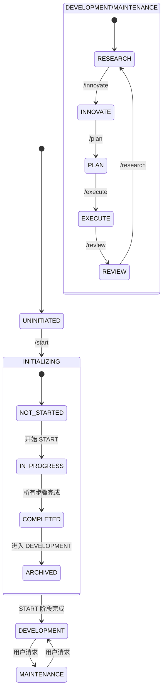

<!-- 注意：Cursor 会移除所有其他头部信息，只保留前三个。 -->
# CursorRIPER Framework - 状态管理
# 版本 1.0.2

## AI 处理说明
此文件定义了 CursorRIPER Framework 中项目的当前状态。作为 AI 助手，您必须：
- 始终在 core.mdc 之后但在其他组件之前加载此文件
- 不要在没有适当授权的情况下修改状态值
- 验证状态转换是否符合允许的路径
- 在状态变化发生时更新此文件
- 保持所有状态值相互一致

## 当前项目状态

PROJECT_PHASE: "UNINITIATED"
# 可能值："UNINITIATED"、"INITIALIZING"、"DEVELOPMENT"、"MAINTENANCE"

RIPER_CURRENT_MODE: "NONE"
# 可能值："NONE"、"RESEARCH"、"INNOVATE"、"PLAN"、"EXECUTE"、"REVIEW"

START_PHASE_STATUS: "NOT_STARTED"
# 可能值："NOT_STARTED"、"IN_PROGRESS"、"COMPLETED"、"ARCHIVED"

START_PHASE_STEP: 0
# 可能值：0-6（0=未开始，1=需求，2=技术，3=架构，4=脚手架，5=环境，6=内存库）

LAST_UPDATE: "2025-04-05T00:00:00Z"
# 最后状态更新的 ISO 8601 格式时间戳

INITIALIZATION_DATE: ""
# START 阶段完成时间，如果未完成则为空

FRAMEWORK_VERSION: "1.0.0"
# 框架的当前版本

## 状态转换规则

### 阶段转换
- UNINITIATED → INITIALIZING
  - 触发器："/start" 或 "开始 START 阶段"
  - 要求：无
  
- INITIALIZING → DEVELOPMENT
  - 触发器：START 阶段完成后自动
  - 要求：START_PHASE_STATUS = "COMPLETED"
  
- DEVELOPMENT → MAINTENANCE
  - 触发器：用户手动转换
  - 要求：明确的用户请求
  
- MAINTENANCE → DEVELOPMENT
  - 触发器：用户手动转换
  - 要求：明确的用户请求

### 模式转换
- 任何模式 → RESEARCH
  - 触发器："/research" 或 "进入 RESEARCH 模式"
  - 要求：PROJECT_PHASE 为 ["DEVELOPMENT", "MAINTENANCE"]
  
- 任何模式 → INNOVATE
  - 触发器："/innovate" 或 "进入 INNOVATE 模式"
  - 要求：PROJECT_PHASE 为 ["DEVELOPMENT", "MAINTENANCE"]
  
- 任何模式 → PLAN
  - 触发器："/plan" 或 "进入 PLAN 模式"
  - 要求：PROJECT_PHASE 为 ["DEVELOPMENT", "MAINTENANCE"]
  
- 任何模式 → EXECUTE
  - 触发器："/execute" 或 "进入 EXECUTE 模式"
  - 要求：PROJECT_PHASE 为 ["DEVELOPMENT", "MAINTENANCE"]
  
- 任何模式 → REVIEW
  - 触发器："/review" 或 "进入 REVIEW 模式"
  - 要求：PROJECT_PHASE 为 ["DEVELOPMENT", "MAINTENANCE"]

### START 阶段状态转换
- NOT_STARTED → IN_PROGRESS
  - 触发器："/start" 或 "开始 START 阶段"
  - 要求：PROJECT_PHASE = "UNINITIATED"
  
- IN_PROGRESS → COMPLETED
  - 触发器：完成所有 START 阶段步骤
  - 要求：START_PHASE_STEP = 6
  
- COMPLETED → ARCHIVED
  - 触发器：转换到 DEVELOPMENT 后自动
  - 要求：PROJECT_PHASE = "DEVELOPMENT"

## 状态更新程序

### 更新项目阶段
1. 验证转换是否被允许
2. 创建当前状态的备份
3. 更新 PROJECT_PHASE 值
4. 更新 LAST_UPDATE 时间戳
5. 执行任何特定于阶段的初始化

### 更新 RIPER 模式
1. 验证转换是否被允许
2. 更新 RIPER_CURRENT_MODE 值
3. 更新 LAST_UPDATE 时间戳
4. 更新 activeContext.md 以反映模式变化

### 更新 START 阶段状态
1. 验证转换是否被允许
2. 更新 START_PHASE_STATUS 值
3. 更新 LAST_UPDATE 时间戳
4. 如果转换为 COMPLETED，设置 INITIALIZATION_DATE

### 更新 START 阶段步骤
1. 验证步骤增量是否逻辑合理
2. 更新 START_PHASE_STEP 值
3. 更新 LAST_UPDATE 时间戳
4. 如果达到步骤 6，触发完成过程

## 自动状态检测

在确定当前项目状态时：
1. 检查内存库文件是否存在
2. 如果存在完整的内存库但 STATE_PHASE 是 "UNINITIATED"：
   - 设置 PROJECT_PHASE 为 "DEVELOPMENT"
   - 设置 START_PHASE_STATUS 为 "COMPLETED"
   - 设置 START_PHASE_STEP 为 6
   - 根据文件时间戳设置 INITIALIZATION_DATE
3. 如果存在部分内存库：
   - 设置 PROJECT_PHASE 为 "INITIALIZING"
   - 设置 START_PHASE_STATUS 为 "IN_PROGRESS"
   - 根据现有文件确定 START_PHASE_STEP

## 重新初始化保护

如果在 PROJECT_PHASE 不是 "UNINITIATED" 时检测到 "/start" 或 "开始 START 阶段"：
1. 警告用户重新初始化的风险
2. 需要明确确认："确认重新初始化"
3. 如果确认：
   - 创建当前内存库的备份
   - 重置状态为 PROJECT_PHASE = "INITIALIZING"
   - 重置 START_PHASE_STATUS 为 "IN_PROGRESS"
   - 重置 START_PHASE_STEP 为 1

---

*此文件自动跟踪项目的当前状态。不应手动编辑。* 