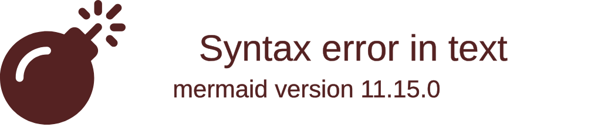

# Progress Tracker: [PROJECT_NAME]
*Version: 1.0*
*Created: [CURRENT_DATE]*
*Last Updated: [CURRENT_DATE]*

## Project Status
Overall Completion: [PERCENTAGE]%

## What Works
- [FEATURE_1]: [COMPLETION_STATUS] - [NOTES]
- [FEATURE_2]: [COMPLETION_STATUS] - [NOTES]
- [FEATURE_3]: [COMPLETION_STATUS] - [NOTES]

## What's In Progress
- [FEATURE_4]: [PROGRESS_PERCENTAGE]% - [NOTES]
- [FEATURE_5]: [PROGRESS_PERCENTAGE]% - [NOTES]
- [FEATURE_6]: [PROGRESS_PERCENTAGE]% - [NOTES]

## What's Left To Build
- [FEATURE_7]: [PRIORITY] - [NOTES]
- [FEATURE_8]: [PRIORITY] - [NOTES]
- [FEATURE_9]: [PRIORITY] - [NOTES]

## Known Issues
- [ISSUE_1]: [SEVERITY] - [DESCRIPTION] - [STATUS]
- [ISSUE_2]: [SEVERITY] - [DESCRIPTION] - [STATUS]
- [ISSUE_3]: [SEVERITY] - [DESCRIPTION] - [STATUS]

## Milestones
- [MILESTONE_1]: [DUE_DATE] - [STATUS]
- [MILESTONE_2]: [DUE_DATE] - [STATUS]
- [MILESTONE_3]: [DUE_DATE] - [STATUS]

---

*This document tracks what works, what's in progress, and what's left to build.*