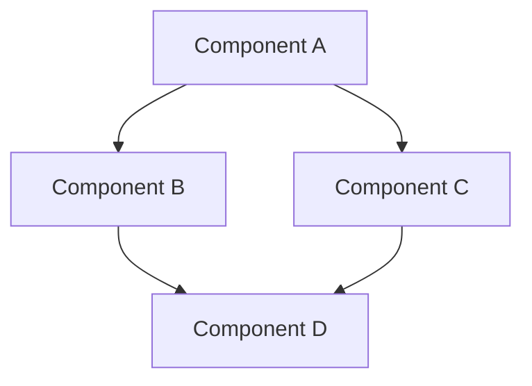
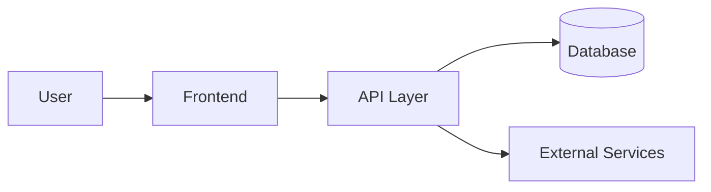

# System Patterns: [PROJECT_NAME]
*Version: 1.0*
*Created: [CURRENT_DATE]*
*Last Updated: [CURRENT_DATE]*

## Architecture Overview
[High-level description of the system architecture]

## Key Components
- [COMPONENT_1]: [PURPOSE]
- [COMPONENT_2]: [PURPOSE]
- [COMPONENT_3]: [PURPOSE]

## Design Patterns in Use
- [PATTERN_1]: [USAGE_CONTEXT]
- [PATTERN_2]: [USAGE_CONTEXT]
- [PATTERN_3]: [USAGE_CONTEXT]

## Data Flow
[Description or diagram of how data flows through the system]

## Key Technical Decisions
- [DECISION_1]: [RATIONALE]
- [DECISION_2]: [RATIONALE]
- [DECISION_3]: [RATIONALE]

## Component Relationships
[Description of how components interact with each other]

---

*This document captures the system architecture and design patterns used in the project.*